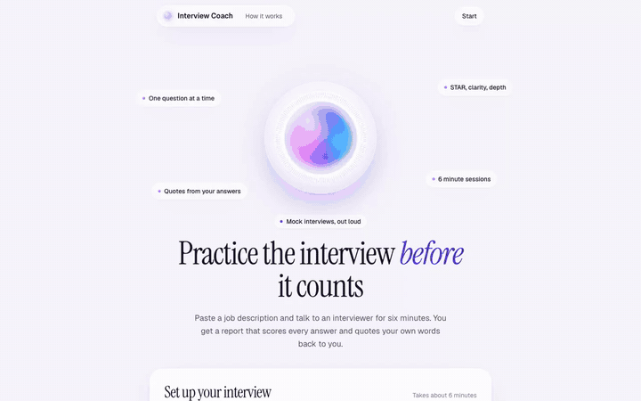
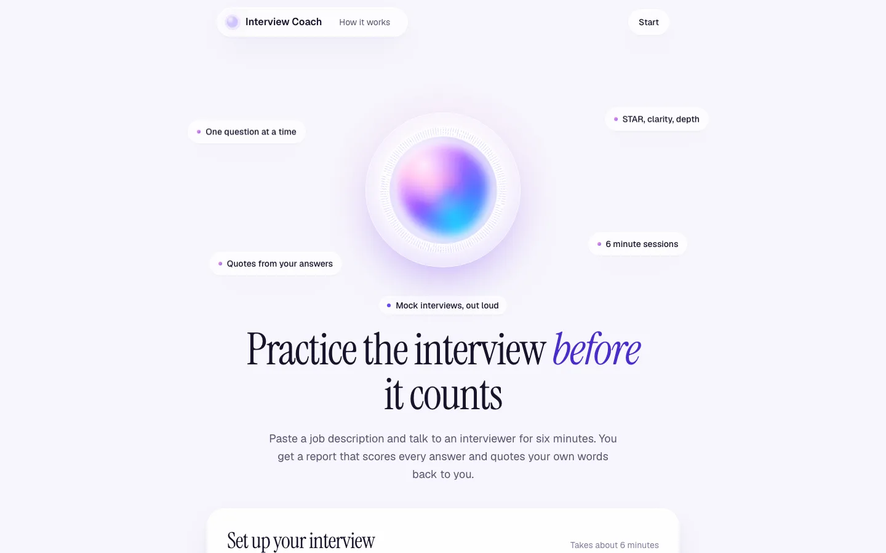
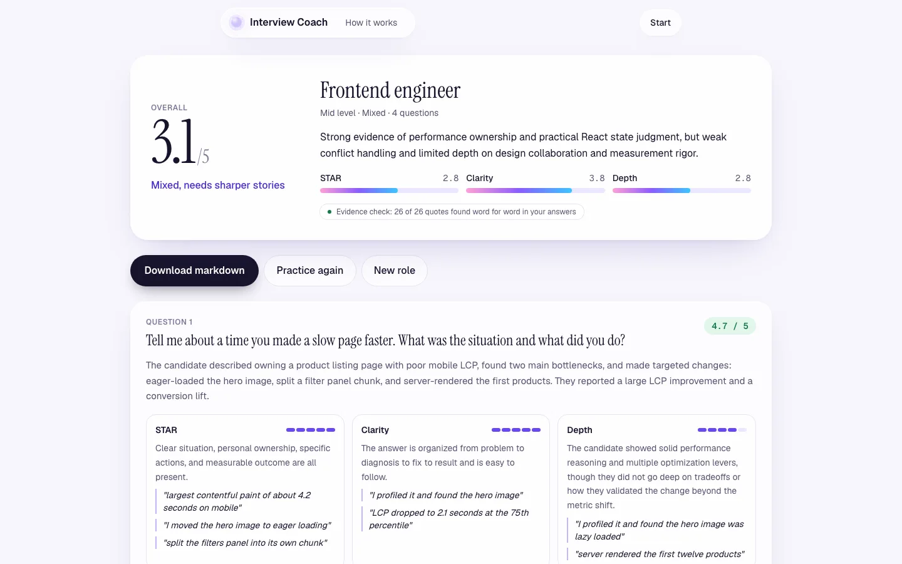

# Interview Coach

A spoken mock interview in the browser that scores each answer and quotes your own words back to you.

**Live demo:** https://interview-coach-seven-rose.vercel.app



## Why it exists

Most people prepare for interviews by rehearsing answers in their head, which hides the rambling and the missing results. Interview Coach lets you paste a job description (or pick a sample role), choose a level and an interview type, and talk to an AI interviewer for six minutes. You then get a report that scores every answer, quotes what you said, and gives you three practice questions aimed at your gaps. No mic? Text mode runs the same interviewer and the same report.

## How it works

**Voice session.** The browser asks for the mic, builds a WebRTC offer, and sends it with the setup to `POST /api/session`. That route validates the setup, applies the rate limit and the daily budget, and opens the call itself with `client.realtime.calls.create` using the server key. The session config (interviewer instructions, `gpt-realtime-mini`, voice, semantic VAD, input transcription with `gpt-4o-transcribe`, `max_output_tokens`, truncation, tracing off) goes with that request, so the browser cannot change it. Only the SDP answer comes back. The browser never receives an API key or a client secret, so there is nothing to reuse for extra sessions.

**Live transcript.** Events on the `oai-events` data channel go through a small reducer (`app/lib/transcript.ts`). Input transcription finishes after the interviewer has started replying, so a candidate turn is placed when its audio is committed and filled in when the transcript arrives. That keeps the order right.

**The orb.** Two Web Audio analysers, one on the mic and one on the remote track, feed RMS levels into CSS variables every frame. Pink reacts to you, blue to the interviewer.

**Session cap.** Six minutes by default. The client runs a visible timer, sends a system note at 30 seconds left so the interviewer closes, and hangs up at zero. The server does not rely on that. When it opens the call it reads the call id from the `Location` header and uses `after()` to keep the function alive until the cap plus 15 seconds, then calls `POST /v1/realtime/calls/{call_id}/hangup`. A client that ignores its own timer gets cut off there. I tested this by holding a call open from the console, and OpenAI closed it at about 377 seconds.

What this does and does not cover:

- Enforced on the server: the session config, one call per `/api/session` request, the hangup at cap plus 15 seconds, 400 output tokens per response, conversation truncation past 12k tokens, and the per IP and daily limits below.
- Needs a Vercel plan that allows the session route's `maxDuration` of 420 seconds (Pro with Fluid compute). Hobby caps functions at 300 seconds, so there you would lower `maxDuration` to 300 and `SESSION_SECONDS` to 270 or less.
- Best effort: if the instance holding the timer dies before it fires, the hangup is lost. Any later `/api/session` request on the same instance hangs up overdue calls, and otherwise the call runs until OpenAI's own session limit.

**Report.** `POST /api/report` shapes the transcript (merge same speaker turns, clean whitespace, cap each turn and the total size), then calls the Responses API with Structured Outputs (`responses.parse` plus `zodTextFormat`). Per question it returns the question, a summary, STAR, clarity and depth scores with evidence quotes, and one improvement. Then the server checks the model's work:

- Every evidence quote is matched against the candidate's lines after normalizing case and punctuation. Quotes it cannot find are dropped from display.
- A score above 3 with no verified quote is capped at 3, and the report says so.
- A question marked answered with no verifiable quote is treated as unanswered and left out of the averages.
- The report shows the grounding rate ("24 of 25 quotes found word for word").

**Text mode.** `POST /api/interviewer` takes the transcript so far and returns the next interviewer message as structured output. It caps at six answers and uses the same report route.

**Abuse and cost controls.** Per IP limits in memory: 3 sessions per hour (voice and text share it), 40 text answers per hour, 5 reports per hour. On top of that, each instance allows `DAILY_SESSION_BUDGET` sessions per UTC day (30 by default) and returns 503 once they are used. The IP comes from `x-real-ip`, then the last `x-forwarded-for` hop, because the leftmost entry is whatever the client sent. Addresses are normalized and IPv6 is grouped by /64, so rotating through one subscriber's addresses or adding a port does not give a fresh limit. The key store is capped at 10,000 entries and evicts the least recently used keys instead of clearing everyone, so flooding it with new keys does not reset other counters. Malformed limit env vars fall back to the defaults instead of turning the limit off. Input is validated before it counts against a limit. Bodies are read as a stream with a hard byte cap and the read stops as soon as it is exceeded, whether `content-length` is missing, wrong or chunked (413). The SDK retries twice with a 60 second timeout. Upstream errors return a short message and never leak details.

### Cost per run

Rough numbers, check current pricing:

- Six minute voice session on `gpt-realtime-mini`: about $0.05 to $0.15, mostly audio tokens, since the conversation is re-read on each turn.
- Input transcription on `gpt-4o-transcribe`: about $0.02 for three minutes of speech.
- Report on `gpt-5.4-mini`: about 1,500 input and 1,500 output tokens, well under a cent.

Text mode costs a few cents at most.

## Screenshots





An 18 second recording of the sample report flow is in [docs/demo.mp4](docs/demo.mp4). Voice mode needs a microphone, so the recording uses the built-in sample interview instead.

## Stack

- Next.js 16 (App Router), React 19, TypeScript, Tailwind CSS 4
- OpenAI Node SDK: Realtime API over WebRTC (`gpt-realtime-mini`), `gpt-4o-transcribe` for live transcription, Responses API with Structured Outputs (`gpt-5.4-mini`)
- zod for request and output schemas
- Deployed on Vercel

## Run it

```bash
npm install
cp .env.example .env.local   # add OPENAI_API_KEY
npm run dev                  # http://localhost:3201
```

```bash
npm test        # transcript shaping, report scoring, body cap and rate limiter
npm run lint
npm run build && npm start
```

## Config

| Variable | Default | What it does |
| --- | --- | --- |
| `OPENAI_API_KEY` | none | Server only. Required. |
| `OPENAI_MODEL` | `gpt-5.4-mini` | Report and text interviewer model |
| `OPENAI_REALTIME_MODEL` | `gpt-realtime-mini` | Voice interviewer model |
| `OPENAI_TRANSCRIBE_MODEL` | `gpt-4o-transcribe` | Live transcription of your answers |
| `OPENAI_VOICE` | `marin` | Interviewer voice |
| `SESSION_SECONDS` | `360` | Voice session cap, clamped to 60 to 390 so the server hangup fits in `maxDuration` |
| `DAILY_SESSION_BUDGET` | `30` | Voice and text sessions per instance per UTC day, 503 after that |
| `RATE_LIMIT_SESSIONS` | `3` | Sessions per IP per window |
| `RATE_LIMIT_TURNS` | `40` | Text answers per IP per window |
| `RATE_LIMIT_REPORTS` | `5` | Reports per IP per window |
| `RATE_LIMIT_WINDOW_MS` | `3600000` | Rate limit window |

The rate limiter and the daily budget are in memory, so on serverless each instance keeps its own counts and a busy deployment with several instances allows that many times the budget. The IP key is only as trustworthy as the proxy in front of the app. Vercel overwrites `x-real-ip`; behind a proxy that passes client headers through, a caller can pick their own key. Swap in a shared store before relying on it in front of real traffic.

## Related

Other small apps built on the OpenAI API:

- [Minutes](https://github.com/Sahilll15/minutes): meeting minutes from diarized audio where every item links back to the transcript. Live at https://minutes-sand.vercel.app
- [SplitSnap](https://github.com/Sahilll15/splitsnap): split a restaurant bill from a receipt photo, exact to the cent. Live at https://splitsnap-sandy.vercel.app
- [ShipNotes](https://github.com/Sahilll15/shipnotes): cited release notes from a GitHub compare range. Live at https://shipnotes-mu.vercel.app
- [AskCSV](https://github.com/Sahilll15/askcsv): ask plain English questions about a CSV, answered with checked SQL in the browser
